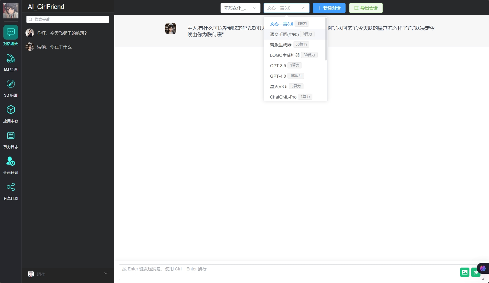

#  手机取证
1. 张子铭手机检材的SHA-1值
5f7e32168e10bc7629f30257f4d547f02e5946c3

2. 分析张子铭手机检材，给张子铭发送AI聊天软件的人的疑似年龄为？
26

3. 分析张子铭手机检材，张子铭为购买AI聊天软件的卡密是？
10c0b2a13e

4. **分析张子铭手机检材，张子铭可能使用过的手机号是？**

5. 分析张子铭手机检材，张子铭为购买AI聊天软件花费了多少元？
100

6. 分析张子铭手机检材，AI聊天软件的SHA256值是？
1790297774f67771f30a63b9beb56a50cef7bc2f5bd05206ad70863a98be10d0

7. 分析张子铭手机检材，接上题，APK签名的签名证书 MD5是？
64843786c6ada15ca4254f4da77e4978

8. 分析张子铭手机检材，接上题，AI聊天软件存放卡密的文件名称是？
 CBGr2.xml

9. 分析许文成手机检材，许文成使用的导航APP名称是？
百度地图

10. 分析许文成手机检材，接上题，许文成最后一次导航地址所在城市是？
西安

11. 分析许文成手机检材，许文成使用的虚拟币钱包地址第二个助记词是？
alter

12. **分析许文成手机检材，许文成虚拟币钱包应用中的ETH地址是？**
34598b08b28924ba446a4219673d86a379fba983

13. 分析许文成手机检材，手机中有一款APP能够隐藏应用和文件，请问该APP的包名是什么？
amarok
11. 分析许文成手机检材，接上题，手机中有应用被隐藏了，请给出被隐藏的第二个应用包名是（从上往下排序）。
com.jm.pindao

12. 分析许文成手机检材，接上题，该应用设置的应用锁密码通过什么方式加密？
calculateHash

13. 分析许文成手机检材，接上题，许文成设置的应用锁密码是?
1111

14. 分析许文成手机检材，接上题，实现应用锁密码加密的类和函数名称是？
HashUtil.calculateHash

15. 分析许文成手机检材，接上题，该应用的telegram开发群组是
Telegram@amarok_dev

16. 分析许文成手机检材，许文成Ai伴侣疑似使用的卡密是？
fcf6c6765f

17. 分析许文成手机检材，许文成微信的微信ID(内部ID)号是？
wxid_6vkhgm0jv93l12

18. 分析许文成手机检材，许文成曾邀请打包APP的技术使用内部聊天工具，请问邀请链接是？
https://matrix.to/#/@xuwencheng:matrix.migu123.xyz

19. 分析何斌手机检材，何斌手机的编译版本号是？
20D67

20. 分析何斌手机检材，手机的UDID是？
00008020-000E24A00AD1002E

21. 分析何斌手机检材，请问Safari浏览器的包名(应用标识)是？
 com.apple.mobilesafari
 
22. 分析何斌手机检材，手机中安装了webclip应用，请问该应用实际访问的域名的标题名称是？
https://play.kaiheifun.com/?category_id=16&channelId=1008&bd_vid=7989472527314724028

23. 分析何斌手机检材，何斌小红书的用户ID(账户ID)号为？
11621147389

24. 分析何斌手机检材，何斌的iCloud（AppleID）账号为？
838299176@qq.com

25. 分析何斌手机检材，包名为“com.katohapps.simplememo”的应用，其在Application目录下的存储编号为
231FA3AD-5139-4C6A-B533-5E58212770BD

26. 分析何斌手机检材，接上题，该应用中记录的结婚纪念日是？
6.2

计算机取证

---

1. 分析许文成计算机检材，请问嫌疑人计算机开机密码是？
838299176

2. 分析许文成计算机检材，嫌疑人电脑的产品ID是？
 00331-10000-00001-AA731

3. 分析许文成计算机检材，请问嫌疑人计算机中创建的用户名？
xuwencheng

4. 分析许文成计算机检材，嫌疑人电脑首次开机至首次关机之间的时长是多少秒？
78

5. 分析许文成计算机检材，嫌疑人电脑桌面上最后修改过的文件名是？
 Element.lnk

6. 分析许文成计算机检材，嫌疑人计算机中存放了其他人员身份证，其中李霜的出生年份是？
1989

7. 分析许文成计算机检材，系统使用邮箱版本为？
 5.0.11.1019

8. 分析许文成计算机检材，其邮箱密码是？
Ss838299176!

9. 分析许文成计算机检材，嫌疑人使用浏览器最近一次在微博搜索的话题是？
欧洲杯 夺冠热门

10. **分析许文成计算机检材，其隐写文件内隐藏的支付密码为？**
520521

10. **分析许文成计算机检材，许文成2月份实发工资为？**

11. 分析何斌检材，请问嫌疑人计算机被远程桌面连接过的IP地址是？
 192.168.230.1

12. 分析何斌检材，请问嫌疑人计算机网卡Ethernet0的MAC地址是？
 00-0C-29-58-AF-FB

13. 分析何斌检材，嫌疑人计算机中使用过代理，请问设置的代理地址端口号是？
7890

14. 分析何斌计算机检材，何斌的工作待办事项有几项？
3

11. 分析何斌计算机检材，该电脑曾经登录的qq号为？
1076423835

12. 分析何斌计算机检材，微软电子钱包中对应的银行卡，其卡上的名称是？
6222358591273488418

13. 分析何斌计算机检材，何斌曾添加了telegram机器人，其完整URL地址是？
https://t.me/ClaraVirtuGFBot/?start=30ba36c3-8f38-4e50-9e92-4dd6abe74f5b

14. 分析何斌计算机检材，免密登录服务器使用的私钥文件sha256值为？
463812811DBCBB3B4C10C5C321CFA4602B8EE55620ED1F8E5DE2DF972B2964C7

15. 分析何斌计算机检材，SillyTavern中的设置的登录用户名为？
user

16. 分析何斌计算机检材，SillyTavern中曾连接的外部AI模型api的csrfSecret值是？
0i1V6McZdDuXxADyWvW2w41yRnZtb64g8hQI2DNm3+Yf84l/HFLwCn18UhhbjbabC25ekHlKMKrGpWEnvNTmmw==

22 分析何斌计算机检材，SillyTavern中一共创建了多少个角色？
5

23 分析何斌计算机检材，SillyTavern中最后一次登录时间是？（UTC）

2024-06-04T11:08:03.319Z 127.0.0.1 Mozilla/5.0 (Windows NT 10.0; Win64; x64) 

17. 分析何斌计算机检材，webui启动界面的端口是？
7860

18. 分析何斌计算机检材，webui中模型WizardLM-7B-uncensored-GPTQ使用的transformers版本是？
4.29.0.dev0

19. 分析何斌计算机检材，AIV5.7换脸软件中，嫌疑人产生的换脸照片的MD5值是？

 E8F902545B4B9C741D7A38906707127C

20. 分析何斌计算机检材，接上题，该换脸软件中，默认线程数是多少？
4

21. 综合分析何斌检材，嫌疑人曾找人注册了一个空壳公司，该公司的统一社会信用代码为？
91420102MA7H8DKL3Q

20. 综合分析何斌检材，通过对公司注册资料元数据进行分析，该文件创建内容的年份为？
2024

---

服务器取证
1. 分析服务器检材，服务器的主机名是？
bin_work

2. 分析服务器检材，服务器的内核版本号为？
6.5.0-35-generic

3. 分析服务器检材，服务器第一次被远程登录的IP地址为？
192.168.230.1

4. 分析服务器检材，请分析登录成功次数最多的用户名是什么？
hebin

5. 分析服务器检材，docker本地镜像的数量为？
12

6. 分析服务器检材，redis容器的版本号为？
6.0.16

7. 分析服务器检材，内部聊天工具的镜像ID为？(前12位)
e394128fb19d7b71c845e0768ece2ff1c54563291eb4eac2fd60193200e039a9

8. 分析服务器检材，内部聊天工具所使用的postgreSQL数据库对外监听的端口号为？
5432

9. 分析服务器检材，内部聊天工具所使用的postgreSQL数据库名为？
matrix_synapse

10. 分析服务器检材，内部聊天工具中何斌用户创建的时间戳为？
1717407297

11. 分析服务器检材，内部聊天工具中聊天记录存放的表名为？
event_search

12. **分析服务器检材，内部聊天数据库中何斌曾用手机登录内部聊天工具，使用的手机的Android版本为**

13. 分析服务器检材，代理软件v2raya的服务端版本号为？

2.2.5.1

systemctl status v2raya启动

 
11. 分析服务器检材，代理软件v2raya现有的订阅地址域名为？
sakuracat1203.xn--3iq226gfdb94q.com

12. 分析服务器检材，代理软件v2raya选择了几个节点进行流量分流？
4

11. 分析服务器检材，AI_GirlFriend（geekai-web）平台监听端口为？

8080

11. 分析服务器检材，请问AI_GirlFriend（geekai-api）网站的容器ID是？(前12位)

4d6765cf13a7

11. 分析服务器检材，AI_GirlFriend（geekai）对登录密码进行了加密，使用的算法为？

重构相关
docker ps 
docker inspect d0  less

11. 分析服务器检材，AI_GirlFriend（geekai）平台创建了多个API-KEY，freegpt的创建时间为？

12. 分析服务器检材，AI_GirlFriend（geekai）平台中名为讯飞的API的API KEY值是？
8765432109|kph3n9u1rdoiphf85lzm9wqkt2v5s6yq|4qy7npbhexog5kfrjzc8mbtw3v6u2ijn

13. 分析服务器检材，AI_GirlFriend（geekai）平台中“费率”为50的模型有多少个？
1

14. 分析服务器检材，AI_GirlFriend（geekai）平台中冯冠的账号是？
15068868752

15. 分析服务器检材，AI_GirlFriend（geekai）平台中阿伟聊天一共消耗了多少算力？
9

16. 分析服务器检材，AI_GirlFriend（geekai）平台中阿伟的推广码是多少？
O2D92L2H

17. 分析服务器检材，AI_GirlFriend（geekai）平台中2023年注册的用户中为启用状态的用户有多少个？
18. 

exe分析取证
真实病毒文件，严禁在物理机运行
1. 分析u盘镜像wao.zip中的exe程序（禁止在物理机上运行），程序运行会访问的网站是：
2. 分析u盘镜像wao.zip中的exe程序（禁止在物理机上运行），生成的文件MD5是：
3. 分析u盘镜像wao.zip中的exe程序（禁止在物理机上运行），程序运行会生成一个压缩包，该压缩包密码是：
4. 分析u盘镜像wao.zip中的exe程序（禁止在物理机上运行），程序会加密电脑文件，请问加密电脑文件对应程序解密前的文件名是：

取证综合分析
1. 综合分析计算机检材和服务器检材，何斌登录内部聊天工具的密码为？

2. 综合分析计算机检材和服务器检材，提供打包apk服务的人员在内部聊天工具中使用的房间主题(ROOM TOPIC)为？
3. 综合分析计算机检材和服务器检材，内部聊天工具中何斌什么时间结束了视频会议？
4. 综合分析计算机检材和服务器检材，内部聊天工具中“app打包”房间聊天发送的交易哈希为？
5. 综合分析计算机检材和服务器检材，内部聊天工具中“app打包”房间聊天发送的APK文件在服务器上被保存的文件夹目录为？(宿主机)
6. 综合分析计算机检材和服务器检材，内部聊天工具中许文成曾经和何斌通话，该房间id为？
7. 综合分析计算机检材和服务器检材，嫌疑人团伙一共购买了多少个打包app：
8. 综合计算机检材、服务器检材，结合互联网分析，嫌疑人团伙和打包服务商进行了虚拟币交易，嫌疑人团伙实际支付了多少usdt？
